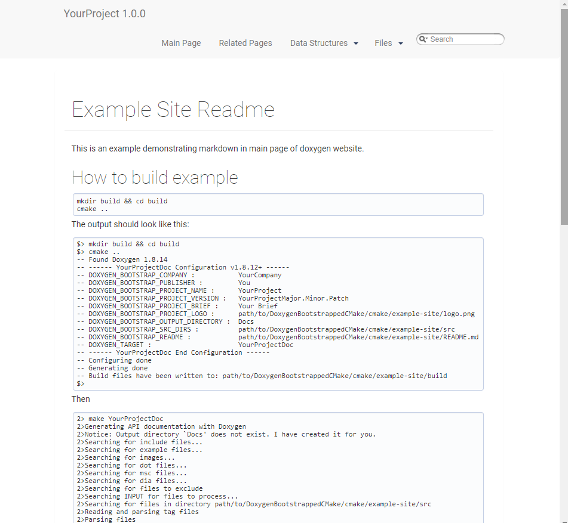

# Example Site Readme

This is an example demonstrating markdown in main page of doxygen website.

## How to build example

```bash
mkdir build && cd build
cmake ..
```

The output should look like this:

```bash
$> mkdir build && cd build
$> cmake ..
-- Found Doxygen 1.8.14
-- ------ YourProjectDoc Configuration v1.8.12+ ------
-- DOXYGEN_BOOTSTRAP_COMPANY :           YourCompany
-- DOXYGEN_BOOTSTRAP_PUBLISHER :         You
-- DOXYGEN_BOOTSTRAP_PROJECT_NAME :      YourProject
-- DOXYGEN_BOOTSTRAP_PROJECT_VERSION :   YourProjectMajor.Minor.Patch
-- DOXYGEN_BOOTSTRAP_PROJECT_BRIEF :     Your Brief
-- DOXYGEN_BOOTSTRAP_PROJECT_LOGO :      path/to/DoxygenBootstrappedCMake/cmake/example-site/logo.png
-- DOXYGEN_BOOTSTRAP_OUTPUT_DIRECTORY :  Docs
-- DOXYGEN_BOOTSTRAP_SRC_DIRS :          path/to/DoxygenBootstrappedCMake/cmake/example-site/src
-- DOXYGEN_BOOTSTRAP_README :            path/to/DoxygenBootstrappedCMake/cmake/example-site/README.md
-- DOXYGEN_TARGET :                      YourProjectDoc
-- ------ YourProjectDoc End Configuration ------
-- Configuring done
-- Generating done
-- Build files have been written to: path/to/DoxygenBootstrappedCMake/cmake/example-site/build
$>
```

Then

```
2> make YourProjectDoc
2>Generating API documentation with Doxygen
2>Notice: Output directory `Docs' does not exist. I have created it for you.
2>Searching for include files...
2>Searching for example files...
2>Searching for images...
2>Searching for dot files...
2>Searching for msc files...
2>Searching for dia files...
2>Searching for files to exclude
2>Searching INPUT for files to process...
2>Searching for files in directory path/to/DoxygenBootstrappedCMake/cmake/example-site/src
2>Reading and parsing tag files
2>Parsing files
2>Preprocessing path/to/DoxygenBootstrappedCMake/cmake/example-site/src/example.cpp...
2>Parsing file path/to/DoxygenBootstrappedCMake/cmake/example-site/src/example.cpp...
2>Reading path/to/DoxygenBootstrappedCMake/cmake/example-site/README.md...
2>Building group list...
2>Building directory list...
2>Building namespace list...
2>Building file list...
2>Building class list...
2>Associating documentation with classes...
2>Computing nesting relations for classes...
2>Building example list...
2>Searching for enumerations...
2>Searching for documented typedefs...
2>Searching for members imported via using declarations...
2>Searching for included using directives...
2>Searching for documented variables...
2>Building interface member list...
2>Building member list...
2>Searching for friends...
2>Searching for documented defines...
2>Computing class inheritance relations...
2>Computing class usage relations...
2>Flushing cached template relations that have become invalid...
2>Computing class relations...
2>Add enum values to enums...
2>Searching for member function documentation...
2>Creating members for template instances...
2>Building page list...
2>Search for main page...
2>Computing page relations...
2>Determining the scope of groups...
2>Sorting lists...
2>Freeing entry tree
2>Determining which enums are documented
2>Computing member relations...
2>Building full member lists recursively...
2>Adding members to member groups.
2>Computing member references...
2>Inheriting documentation...
2>Generating disk names...
2>Adding source references...
2>Adding xrefitems...
2>Sorting member lists...
2>Computing dependencies between directories...
2>Generating citations page...
2>Counting data structures...
2>Resolving user defined references...
2>Finding anchors and sections in the documentation...
2>Transferring function references...
2>Combining using relations...
2>Adding members to index pages...
2>Generating style sheet...
2>Generating search indices...
2>Generating example documentation...
2>Generating file sources...
2>Parsing code for file example.cpp...
2>Parsing code for file README.md...
2>Generating file documentation...
2>Generating docs for file example.cpp...
2>Generating page documentation...
2>Generating docs for page todo...
2>Generating group documentation...
2>Generating class documentation...
2>Generating docs for compound Test...
2>Generating namespace index...
2>Generating graph info page...
2>Generating directory documentation...
2>Generating index page...
2>Generating page index...
2>Generating module index...
2>Generating namespace index...
2>Generating namespace member index...
2>Generating annotated compound index...
2>Generating alphabetical compound index...
2>Generating hierarchical class index...
2>Generating member index...
2>Generating file index...
2>Generating file member index...
2>Generating example index...
2>finalizing index lists...
2>writing tag file...
2>lookup cache used 143/65536 hits=682 misses=210
2>finished...
```

## Screenshoot

